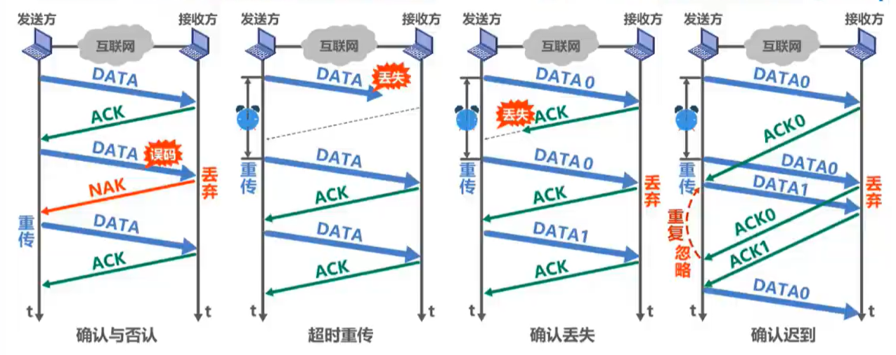
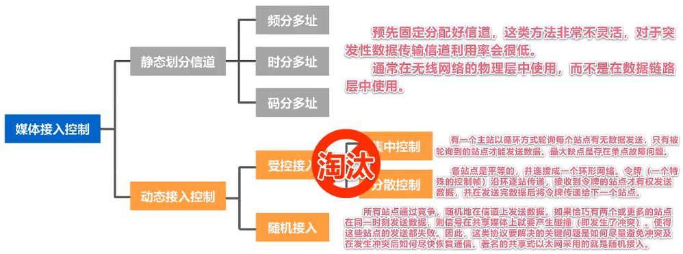
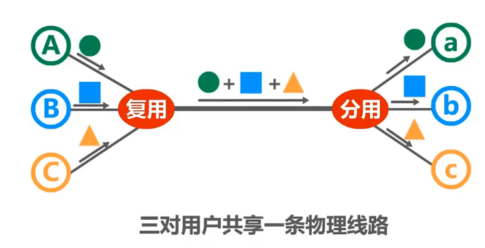
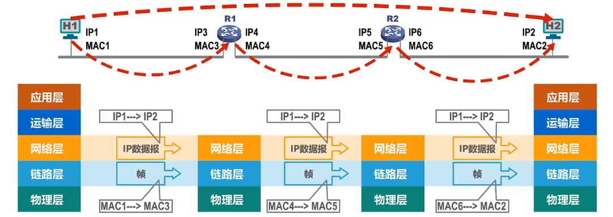

# 三、数据链路层
## 1. 数据链路层概述
- 链路：就是从一个结点到相邻结点的一段物理线路，而**中间没有任何其他的交换结点**。
- 数据链路：是指把实现通信协议的硬件和软件加到链路上，就构成了数据链路。
- 数据链路层的三个重要问题：
  - 封装成帧
  - 差错检测
  - 可靠传输
- 使用广播信道的数据链路层
  - 共享式以太网的媒体接入控制协议CSMA／CD
  - 802.11局域网的媒体接入控制协议CSMA／CA
  
## 2. 封装成帧
- 定义：数据链路层给上层协议交付的协议数据层添加（MAC或PPP）帧头帧尾
- MTU：帧的数据部分长度上限

  

## 3. 差错检测
校验方法：
- 奇偶校验
- 循环冗余校验CRC

## 4. 可靠传输
传输差错包括：
- 比特差错
- 分组丢失
- 分组失序
- 分组重复
> 分组丢失、分组失序、分组重复一般出现在数据链路层的上层

实现机制：
- 停止-等待协议SW
  - 确认与否认
  - 超时重传
  - 确认丢失
  - 确认迟到
  
  
  > ACK: 确认分组；NAK: 否认分组（ACK、HAK都有序号）

  SW协议信道利用率：$U=\displaystyle\frac{T_D}{T_D+RTT+T_A}$
- 回退N帧协议GBN
  
  
  - 发送窗口尺寸：$1<W_T\leq 2^n-1$
  - 接受窗口尺寸：$W_R=1$
- 选择重传协议SR
  
  
  - 发送窗口尺寸：$1<W_T\leq 2^n-1$
  - 接受窗口尺寸：$1<W_R\leq W_T$

## 5. 点对点协议PPP
用户计算机与ISP进行通信时，所使用的数据链路层协议通常就是PPP协议；点对点PPP协议也广泛应用于广域网路由器之间的专用线路。

- PPP协议三部分：
  - 封装成帧
  - 链路控制协议LCP
  - 一套网络控制协议NCPs

  

## 6. 媒体接入控制
- 基本概念：共享信道要着重考虑的一个问题就是如何协调多个发送和接收站点对一个共享传输媒体的占用，即媒体接入控制MAC（Medium Access Control）。

  
- 静态划分信道（信道复用/信道多址）
  
  
  > 复用：通过一条物理线路同时传输多路用户的信号
  - 频分复用FDM
  - 时分复用TDM
  - 波分复用WDM
  - 码分复用CDM
- 随机接入
  - CSMA/CD协议：载波监听多址接入/碰撞检测
  - CSMA/CA协议：载波监听多址接入/碰撞避免

## 7. MAC地址、IP地址及ARP协议
||概念|作用|位置|
|-|-|-|-|
|MAC地址|以太网的MAC子层所使用的地址|每个主机发送的**帧中必须携带标识发送主机和接受主机的MAC地址**|数据链路层|
|IP地址|TCP／IP体系结构网际层所使用的地址|标识**网络编号和主机编号**|网络层|
|ARP协议|地址解析协议|已知设备所分配到的IP地址，使用ARP协议可以**通过该IP地址获取到设备的MAC地址**|网络层|

数据包转发过程中IP地址与MAC地址的变化情况；

- 数据包转发过程中源IP地址和目的IP地址保持不变
- 数据包转发过程中源MAC地址和目的MAC地址逐个链路(或逐个网络)改变

## 8. 集线器与交换机的区别
||作用|位置|
|-|-|-|
|交换机|根据MAC地址对帧进行转发|数据链路层|
|集线器(淘汰)|对接收到的信号进行放大、转发|物理层|

## 9. 以太网交换机自学习和转发帧的流程
```mermaid
graph TD
  A["接收到帧"]-->B["在帧交换表中查找帧的目的MAC地址对应的接口号"]-->C["通过该接口转发帧"]
```

- 以太网交换机是一种即插即用设备，刚上电启动时其内部的帧交换表是空的。**随着网络中各主机间的通信，以太网交换机通过自学习算法自动逐渐建立起帧交换表。**

## 10. VLAN(虚拟局域网)
- 概述：VLAN是一种将局域网内的设备划分成**与物理位置无关的逻辑组**的技术，这些逻辑组具有某些共同的需求。
  
  